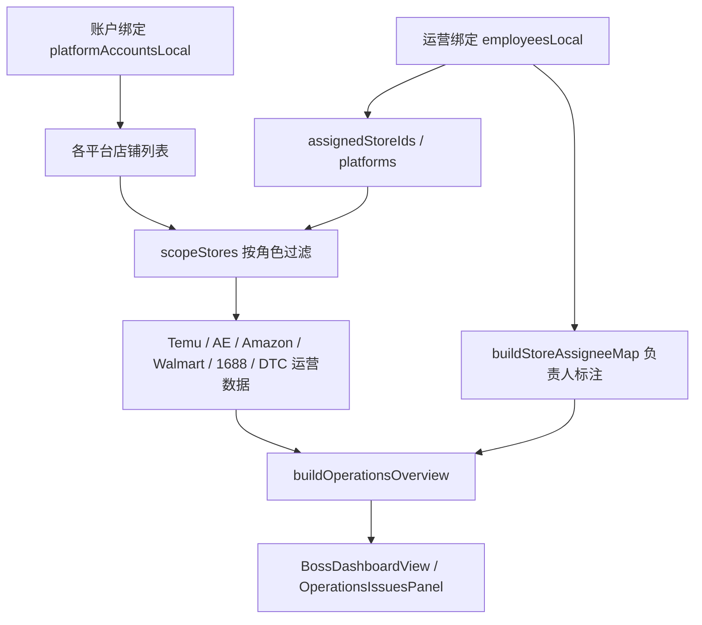
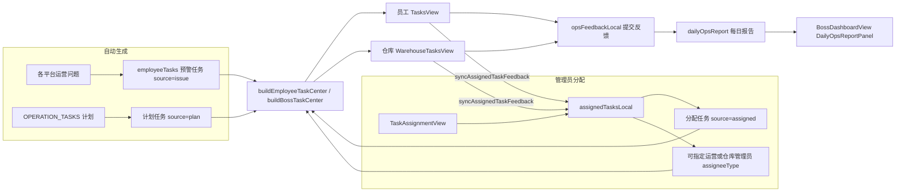
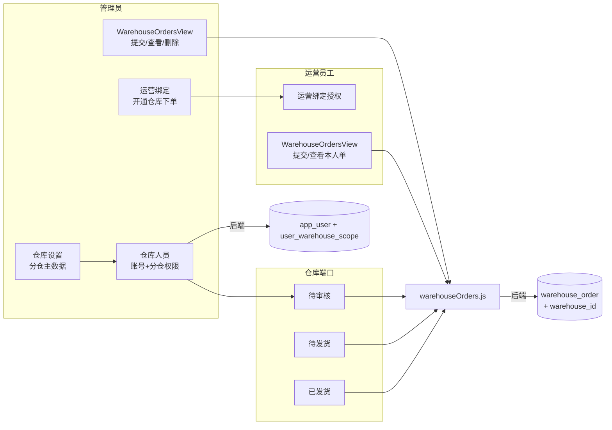

# CrossHub 跨境运营管理平台

CrossHub 是一套面向跨境企业的 **SaaS 运营管理工作台** Demo。支持 **企业管理员、员工、仓库** 三端登录，覆盖 Temu、AliExpress、Amazon、Walmart、1688、**独立站**（运营维度统一为 `dtc`；账户绑定层仍区分 Shopify / WordPress）等多平台运营场景，提供账户绑定、运营总览、异常预警、**任务分配与协同**、**多仓出库下单**、每日运营报告与 AI 办公辅助。

> 当前版本以 **前端 Demo + 浏览器 localStorage** 为主，无需数据库即可完整体验；可选启动本地 Express API 服务用于部分账户绑定接口联调。

---

## 技术栈

| 类别 | 选型 |
|------|------|
| 框架 | Vue 3（Composition API + `<script setup>`） |
| 构建 | Vite 8 |
| 路由 | Vue Router 5 |
| 状态 | Pinia |
| UI | Element Plus + `@element-plus/icons-vue` |
| 语言 | JavaScript（ES Module） |
| Node | `^22.18.0` 或 `>=24.12.0` |

界面采用 **Soybean / Arco 风格** 设计令牌（`assets/theme.css`），浅色侧栏工作台 + 分屏登录布局。

---

## 快速开始

```bash
# 进入前端项目
cd dev/vue-site

# 安装依赖
npm install

# 启动开发服务器（默认 http://localhost:5173）
npm run dev

# 生产构建
npm run build

# 预览构建产物
npm run preview
```

### 可选：本地 API 服务

部分历史接口通过 Vite 代理转发到 `http://localhost:3000`（见 `vite.config.js`）。如需启动：

```bash
npm run dev:api
# 等价于：npm --prefix ../../script/api-server run dev
```

当前 Demo 主流程（登录、员工、店铺、运营数据、任务分配）**不依赖**该服务，数据保存在浏览器 localStorage。

### Demo / 后端模式

| 模式 | 配置 | 说明 |
|------|------|------|
| **纯前端 Demo（默认）** | `dev/vue-site/.env` → `VITE_USE_TEMU_BACKEND=false` | 登录、运营绑定、任务、出库单均走 `*Local.js`；无需启动 Java |
| **Java 联调** | `VITE_USE_TEMU_BACKEND=true` 且启动 Java API | Boss 登录后运营绑定 / 仓库人员 / 出库单等可走 `/api/tenant`、`/api/warehouse` |

> 未启动 Java 时请勿开启后端开关；`employees.js` 使用 `canUseTenantMembersBackend(auth)` 避免「读 localStorage、写 Java」导致保存 502。

---

## 项目结构

```
dev/vue-site/
├── index.html
├── vite.config.js          # 路径别名 @ → src，/api 代理
├── package.json
└── src/
    ├── main.js             # 应用入口，初始化 Demo 数据
    ├── App.vue
    ├── router/index.js     # 路由与守卫
    ├── stores/
    │   └── auth.js         # 登录态、角色、企业/员工信息
    ├── layouts/
    │   ├── AuthLayout.vue      # 登录/注册壳
    │   └── PortalLayout.vue    # 工作台侧栏 + 内容区（用户信息在侧栏底部）
    ├── views/
    │   ├── auth/               # LoginView, RegisterView
    │   ├── boss/               # 企业管理员：总览、任务分配、运营/账户/仓库设置、仓库下单
    │   ├── employee/           # 员工：工作台、任务中心、仓库下单、AI 办公
    │   ├── warehouse/          # 待审核 / 待发货 / 已发货 / 任务中心；分仓展示面板
    │   ├── temu/ aliexpress/ amazon/ walmart/ alibaba1688/ dtc/
    ├── components/
    │   ├── auth/               # 分屏布局、SaaS 插画
    │   ├── dashboard/          # 运营总览、问题面板、每日报告
    │   ├── tasks/              # 任务反馈弹窗、详情抽屉、反馈时间线
    │   ├── accounts/           # BindStoreDialog 等账户绑定组件
    │   ├── warehouse/          # 出库单表单、审批、确认可发、WarehouseScopePanel
    │   ├── ai/                 # AI 办公对话面板
    │   ├── temu/ aliexpress/ amazon/ walmart/ alibaba1688/ dtc/ common/
    ├── api/                    # 数据访问层（Facade）
    │   ├── auth.js / authLocal.js
    │   ├── employees.js / employeesLocal.js
    │   ├── platformAccounts.js / platformAccountsLocal.js
    │   ├── assignedTasks.js / assignedTasksLocal.js   # 管理员任务分配
    │   ├── opsFeedback.js / opsFeedbackLocal.js       # 员工任务反馈
    │   ├── operationsOverview.js   # 运营总览 + 任务中心聚合
    │   ├── warehouseOrders.js / warehouseOrdersLocal.js   # 仓库出库下单
    │   ├── warehouseSites.js / warehouseSitesLocal.js   # 分仓主数据
    │   ├── warehouseStaff.js / warehouseStaffLocal.js   # 仓库人员（仅 Boss 管理）
    │   ├── temu*.js aliexpress*.js amazon*.js walmart*.js alibaba1688*.js dtc*.js
    │   └── http.js
    ├── utils/
    │   ├── scope.js                # 按角色过滤可见店铺/菜单
    │   ├── storeAssignment.js      # 店铺 → 负责人映射
    │   ├── operationsOverview.js   # 各平台问题项聚合
    │   ├── employeeTasks.js        # 任务中心：预警 + 计划 + 分配任务
    │   ├── dailyOpsReport.js       # 管理员每日运营报告
    │   ├── warehouseOrders.js      # 出库单表单/状态工具
    │   └── temu.js aliexpress.js amazon.js walmart.js ...
    ├── constants/
    │   ├── platforms.js employees.js assignedTasks.js opsFeedbackDemo.js
    │   ├── warehouseOrders.js warehouseUsers.js warehouseStaff.js warehouseSites.js
    │   ├── aiOffice.js             # AI 办公技能与 Mock 回复
    │   └── temu.js temuOps.js aliexpressDemo.js amazonDaily.js walmartDemo.js ...
    ├── composables/
    │   ├── useStoreAssignees.js
    │   └── useYotoMascot.js        # 登录页密码框 focus 遮眼（可选交互）
    └── assets/
        ├── main.css theme.css auth-panel.css
```

---

## 架构与数据流

### 整体分层

```
Views（页面）
    ↓ 调用
API Facade（src/api/*.js）
    ↓ 当前 Demo 主要走
Local 实现（*Local.js + localStorage）
    ↓ 读取
Constants（静态样本） + Utils（计算/聚合）
```

页面 **不直接** 读写 localStorage，统一通过 `src/api/` 层访问，便于后续替换为真实 HTTP 接口。

### 运营总览数据链路



入口函数：`loadOperationsOverview(auth)`（`src/api/operationsOverview.js`）

### 任务协同数据链路



---

## 身份与权限

### 三种角色

| 角色 | 路由前缀 | UI 文案 | 能力 |
|------|----------|---------|------|
| 企业管理员 | `/boss/*` | 企业管理员 | 全店铺可见；**运营绑定** / 账户绑定 / **仓库设置** / **仓库人员**（**设置** 子菜单）；运营总览；**任务分配**；**仓库下单**（查看全员单据、**删除**出库单）；每日运营报告 |
| 员工 | `/employee/*` | 员工端口 | 仅可见被分配店铺或所属平台；任务中心；**仓库下单**（需管理员开通「仓库下单」权限，仅本人单据）；提交反馈；AI 办公 |
| 仓库 | `/warehouse/*` | 仓库端口 | 侧栏 **待审核 / 待发货 / 已发货 / 任务中心**；仅可见已分配分仓的订单；审批、确认可发、标记发货；**任务中心**接收管理员分配任务并反馈；侧栏/顶栏展示 **负责分仓**；**不可**管理仓库人员 |

> 代码内部仍使用 `boss` / `isBoss` 命名，界面已统一为「企业管理员」。

### 权限过滤（`src/utils/scope.js`）

- **`scopeStores(stores, auth)`** — 管理员返回全部店铺；员工按 `assignedStoreIds` 或 `platforms` 过滤（选中 **独立站** `dtc` 时包含 Shopify / WordPress 店铺）
- **`employeeModuleMenus(auth)`** — 按运营绑定平台动态生成侧栏菜单
- **`employeeHasPlatform(auth, platform)`** — 模块内 Tab / 功能是否展示

### 路由守卫（`router/index.js`）

1. 未登录 → 重定向 `/login`
2. 已登录访问登录/注册页 → 按角色跳转默认首页
3. 角色与路由 `meta.role` 不匹配 → 跳回各自首页
4. 后端登录时按 `sys_menu` / `menuCode` 校验页面权限

登录态与角色信息写入 **localStorage**（`crosshub_*`），刷新后仍保持登录；退出或 Token 失效时清除。

---

## 路由一览

### 认证

| 路径 | 页面 | 说明 |
|------|------|------|
| `/login` | LoginView | 企业管理员 / 员工 / **仓库** 三端登录（Tab 切换） |
| `/register` | RegisterView | 企业注册 |

### 企业管理员 `/boss`

| 路径 | 页面 | 说明 |
|------|------|------|
| `/boss/dashboard` | BossDashboardView | 跨平台运营总览 + 每日运营报告（默认首页） |
| `/boss/tasks` | TaskAssignmentView | **向运营 / 仓库管理员分配任务** |
| `/boss/warehouse-orders` | WarehouseOrdersView | **仓库下单**（提交出库申请、查看全员单据） |
| `/boss/temu` | TemuModuleView | Temu 专项 |
| `/boss/aliexpress` | AliExpressModuleView | 速卖通专项 |
| `/boss/amazon` | AmazonModuleView | Amazon 专项 |
| `/boss/walmart` | WalmartModuleView | Walmart 专项 |
| `/boss/1688` | Alibaba1688ModuleView | 1688 专项 |
| `/boss/dtc` | DtcModuleView | 独立站专项 |
| `/boss/employees` | EmployeeBindingView | **运营绑定**：弹窗 CRUD、平台权限、店铺分配、仓库下单开关 |
| `/boss/warehouse-sites` | WarehouseSitesView | **仓库设置**：维护分仓（名称、编码、地址） |
| `/boss/warehouse-staff` | WarehouseStaffBindingView | **仓库人员**：仓库端口账号、岗位、分仓权限 |
| `/boss/accounts` | AccountBindingView | 多平台店铺账户绑定（**设置** 子菜单） |

> 侧栏 **设置** 分组下包含「**运营绑定**」「**仓库设置**」「**仓库人员**」「账户绑定」；默认首页为 `/boss/dashboard`。

### 仓库 `/warehouse`

| 路径 | 页面 | 说明 |
|------|------|------|
| `/warehouse/pending-review` | WarehouseOrdersView | **待审核**：审批新提交的出库单 |
| `/warehouse/pending-shipment` | WarehouseOrdersView | **待发货**：含待出库与暂不可发（确认可发 / 标记发货） |
| `/warehouse/shipped` | WarehouseOrdersView | **已发货**：已完成出库记录 |
| `/warehouse/tasks` | WarehouseTasksView | **任务中心**：管理员分配任务 + 提交反馈 |

> 侧栏含 **待审核 / 待发货 / 已发货 / 任务中心**；默认首页为 `/warehouse/pending-review`；旧路径 `/warehouse/orders` 会自动重定向。登录后 **WarehouseScopePanel** 展示该仓管负责的分仓名称。

### 员工 `/employee`

| 路径 | 页面 | 说明 |
|------|------|------|
| `/employee/dashboard` | DashboardView | 个人工作台 |
| `/employee/tasks` | TasksView | **任务中心**（预警 + 计划 + 管理员分配） |
| `/employee/temu` 等 | 与各平台 ModuleView 共用 | 按权限显示 |
| `/employee/warehouse-orders` | WarehouseOrdersView | **仓库下单**（仅本人提交的单据） |
| `/employee/ai` | AiOfficeView | AI 办公（Mock 对话 + 技能快捷入口） |

---

## 数据层设计

### API Facade 与 Local 实现

典型模式：

```
src/api/employees.js          → 对外导出 fetchEmployees / saveEmployee ...
src/api/employeesLocal.js     → localStorage 读写实现
```

| 模块 | Facade | Local 存储 Key（localStorage） |
|------|--------|-------------------------------|
| 企业账号 | `auth.js` | `crosshub_auth_users` |
| 员工 | `employees.js` | `crosshub_employees` |
| 店铺绑定 | `platformAccounts.js` | `crosshub_platform_stores` |
| **分仓** | `warehouseSites.js` | `crosshub_warehouse_sites` |
| **任务分配** | `assignedTasks.js` | `crosshub_assigned_tasks` |
| **任务反馈** | `opsFeedback.js` | `crosshub_ops_feedback` |
| **仓库出库单** | `warehouseOrders.js` | `crosshub_warehouse_orders`（本地 Demo）；后端模式见 `warehouseOrdersApi.js` → SQLite `warehouse_order` |
| **仓库人员** | `warehouseStaff.js` | `crosshub_warehouse_staff`（本地 Demo）；后端模式见 `/api/warehouse/members` → `app_user`（role=warehouse） |
| Temu 补货状态 | `temuRestockLocal.js` | `crosshub_temu_restock_status` |
| Temu 竞店 | `temuCompetitorsLocal.js` | 多个 key，见对应文件 |
| AliExpress 订单/违规 | `aliexpress*Local.js` | 按店铺 lazy 写入 |
| Amazon 一日运营 | `amazonDailyLocal.js` | 买家消息、账户、差评、优惠券等 |
| Walmart 订单/Listing | `walmart*Local.js` | 按店铺 lazy 写入 |
| 1688 采购 | `alibaba1688DemoLocal.js` | 按店铺 lazy 写入 |
| DTC 订单 | `dtcOrdersLocal.js` | 按店铺 lazy 写入 |

### 任务分配 API（`assignedTasks.js`）

| 方法 | 说明 |
|------|------|
| `fetchAssignedTasks(filters?)` | 查询已分配任务 |
| `fetchAssignedTaskDetail(taskId)` | 任务详情 + 反馈时间线 + 流程进度 |
| `syncAssignedTaskFeedback(taskId, payload)` | 员工/仓管反馈后同步任务状态与 lastFeedback |
| `assignTask(payload, context)` | 分配任务（支持 `assigneeType`: `employee` / `warehouse`） |
| `assignTaskToEmployee(payload, employees)` | 向指定运营分配（兼容旧调用） |
| `fetchWarehouseAssignedTasks(auth)` | 仓库任务中心列表 |
| `updateAssignedTask(id, payload)` | 编辑任务 |
| `cancelAssignedTask(id)` | 取消任务 |
| `removeAssignedTask(id)` | 删除任务 |
| `updateAssignedTaskStatus(id, status, extra?)` | 更新状态（员工反馈时调用） |
| `fetchAssignedTasksForCenter(auth, employees)` | 转为任务中心统一结构 |

### 仓库出库单 API（`warehouseOrders.js`）

**双模式**：已用后端账号登录且 Java API 可用时，自动走 `warehouseOrdersApi.js`（`/api/warehouse/*`）；否则回退 `warehouseOrdersLocal.js`。

| 方法 | 说明 |
|------|------|
| `canUseWarehouseBackend(auth)` | 是否使用后端持久化 |
| `fetchWarehouseOrders(auth, filters?)` | 查询出库单（员工仅本人；管理员看全部；仓库按 **分仓权限** 过滤） |
| `createWarehouseOrder(auth, payload)` | 新建出库单（须选择 **出库仓库** `warehouseId`） |
| `submitWarehouseReview(auth, orderId, payload)` | 仓库审批：可发 → 待发货；不可发 → 暂不可发 |
| `releaseBlockedWarehouseOrder(auth, orderId, payload)` | **补货完成后确认可发** → 待发货 |
| `markWarehouseOrderShipped(orderId, auth)` | 标记已发货（仅待发货状态） |
| `cancelWarehouseOrder(orderId, auth)` | 取消订单（管理员 / 员工本人，待审核或暂不可发） |
| `deleteWarehouseOrder(orderId, auth)` | **删除订单**（仅企业管理员，物理删除） |
| `canReviewOrder` / `canReleaseBlocked` / `canMarkShipped` / `canDeleteOrder` | 按角色与状态判断操作权限 |

### 平台常量（`src/constants/platforms.js`）

```text
跨境平台：temu | aliexpress | amazon | walmart | 1688
国内电商：pdd | douyin | channels
独立站：  dtc（运营绑定 / 任务 / 出库单货源）
          shopify | wordpress（账户绑定时的店铺类型，归入「独立站」类目）
```

- 运营绑定、任务分配、员工侧栏菜单使用统一平台键 **`dtc`（独立站）**
- `fetchDtcStores()` 仍合并 Shopify + WordPress 店铺为独立站运营视图
- 选中 `dtc` 时，店铺分配与 `scopeStores` 自动包含两类独立站店铺

### 远程 HTTP（预留）

- `src/api/http.js`：`fetch` 封装，基址 `VITE_API_BASE_URL`
- `vite.config.js`：`/api` → `localhost:3000`
- `script/api-server/`：Express 示例服务（内存存储，仅 Temu / AliExpress 绑定）

接入真实后端时，只需在 Facade 层将 `*Local.js` 调用替换为 `http.request(...)`，**View 层无需大改**。

---

## 核心业务模块

### 1. 账户绑定（`AccountBindingView`）

- 统一列表 + 平台筛选芯片，替代原先多卡片布局
- 通过 `BindStoreDialog` 弹窗绑定/编辑店铺
- 数据写入 `platformAccountsLocal`，后续所有运营模块通过 `fetchPlatformStores(platform)` 读取

### 2. 运营绑定（`EmployeeBindingView`）— 企业管理员

- 路径：`/boss/employees`（侧栏 **设置 → 运营绑定**）
- 列表 + **弹窗** 添加/编辑：姓名、账号、岗位、负责平台、负责店铺、**仓库下单** 开关、启用状态
- **负责平台**：跨境 / 国内 / **独立站**（`dtc`）/ 其他；不再单独列出 Shopify、WordPress
- **仓库下单**：唯一可分配的运营扩展权限（`employee.warehouse`）；运营模块仍按负责平台自动显示
- 岗位选项为各平台运营角色（仓库岗位统一为 **仓库管理员**，在「仓库人员」中维护）
- `validateStoreAssignmentConflict` 防止同一店铺分配给多人

### 2b. 仓库设置（`WarehouseSitesView`）— 企业管理员

- 路径：`/boss/warehouse-sites`（侧栏 **设置 → 仓库设置**）
- 维护分仓主数据：名称、编码、地址、排序、启用状态
- Demo 种子：**泰州1号仓**、**泰州邮政仓**、**安徽仓库**
- 本地：`warehouseSitesLocal.js`；后端：`GET/POST/PUT/PATCH/DELETE /api/warehouse/sites`

### 2c. 仓库人员（`WarehouseStaffBindingView`）— 仅企业管理员

- 路径：`/boss/warehouse-staff`（侧栏 **设置 → 仓库人员**）
- **弹窗** 维护仓库端口账号：姓名、账号、**管理仓库**（多选分仓）；岗位固定为 **仓库管理员**
- 本地 Demo：`warehouseStaffLocal.js` + `constants/warehouseUsers.js`
- 后端：`/api/warehouse/members` → `app_user`（`role=warehouse`）+ `user_warehouse_scope`
- **仓库管理员登录后不可** 新增或绑定仓库人员（无对应菜单与 API 权限）

### 3. 运营总览（`BossDashboardView`）

| 组件 | 说明 |
|------|------|
| `OperationsSummaryHeader` | 各平台指标摘要 |
| `OperationsIssuesPanel` | 跨平台待办/异常（补货、亏损、订单、违规等） |
| `OperationsTasksPanel` | 任务列表（含分配任务） |
| `DailyOpsReportPanel` | **每日运营报告**：汇总问题处理进度与员工反馈 |

数据来源：`loadOperationsOverview(auth)` 一次性聚合各平台 payload、任务中心与日报。

### 4. 任务分配（`TaskAssignmentView`）— 管理员

- 路径：`/boss/tasks`
- 向 **运营人员** 或 **仓库管理员** 指派任务：标题、说明、平台/关联分仓、类型、优先级、截止时间
- 仓储任务类型：出库、入库、盘点、拣货、包装、物流等（`WAREHOUSE_TASK_CATEGORY_OPTIONS`）
- 支持编辑、取消、删除；按负责人类型 / 负责人 / 状态 / **需协助** 筛选
- 列表展示 **最新反馈**（结果标签 + 摘要）与状态；无百分比进度条
- **任务详情抽屉**（`AssignedTaskDetailDrawer`）：四步流程 + 完整反馈时间线；「需协助 / 受阻」高亮
- 分配后：运营任务 → 员工 **任务中心**；仓储任务 → 仓库 **任务中心**（`source=assigned`）

#### 任务分配反馈流程

```text
管理员分配任务（TaskAssignmentView，assigneeType=employee|warehouse）
        ↓
员工 / 仓管任务中心收到（source=assigned）
        ↓
提交反馈（TaskFeedbackDialog → opsFeedbackLocal + syncAssignedTaskFeedback）
        ↓
分配任务状态 / lastFeedback 更新（assignedTasksLocal）
        ↓
管理员详情时间线 / 员工·仓管详情抽屉查看历史反馈
```

| 反馈结果 | 任务状态 | 说明 |
|----------|----------|------|
| 已处理 | 已完成 | 流程结案 |
| 跟进中 | 进行中 | 持续跟进 |
| 需协助 / 受阻 | 进行中 | 管理员侧标记需关注 |

### 5. 任务中心（`TasksView`）— 员工

任务来源三类，由 `utils/employeeTasks.js` 聚合：

| 来源 | `source` | 说明 |
|------|----------|------|
| 运营预警 | `issue` | 从各平台运营问题自动生成，按员工平台/店铺权限过滤 |
| 计划任务 | `plan` | 来自 `constants/operations.js` 的 `OPERATION_TASKS` |
| 管理员分配 | `assigned` | 来自 `assignedTasksLocal`，**独立区块**展示，字段与 Boss 列表对齐 |

功能：

- 顶部指标 + 筛选：**全部 / 管理员分配 / 各平台**
- **管理员分配** 与 **平台运营任务** 分开展示（不再混在同一平台分组）
- **详情**：分配任务 → `AssignedTaskDetailDrawer`（含完整反馈时间线）；运营任务 → `EmployeeTaskDetailDrawer`
- **提交反馈**：`TaskFeedbackDialog`（卡片式处理结果 + 说明）；历史反馈**仅在详情**中查看
- 对 `assigned` 类型，反馈后 `syncAssignedTaskFeedback` 同步至 Boss **任务分配**

### 5b. 任务中心（`WarehouseTasksView`）— 仓库

- 路径：`/warehouse/tasks`
- 展示分配给当前仓管的任务（`fetchWarehouseAssignedTasks`）
- 提交反馈同样写入 `opsFeedbackLocal` 并同步 `assignedTasksLocal`

### 6. Temu 运营（`TemuModuleView`）

- 商品样本：`constants/temu.js` → `utils/temu.js` enrich（利润、滞销、补货 urgency）
- 子面板：概览、亏损 SKU、滞销、爆款播报、补货计划、竞店分析
- 补货处理状态：`temuRestockLocal.js`

### 7. AliExpress 运营（`AliExpressModuleView`）

- 订单、违规记录：首次加载时 `ensureAliexpressDemoData` 生成
- 管理员/员工视图共用，通过 `scopeStores` 过滤

### 8. Amazon 运营（`AmazonModuleView`）

围绕卖家 **一日运营工作流** 设计，共 7 项巡检 + 今日工作台：

| 步骤 | 模块 | 说明 |
|------|------|------|
| 1 | 买家消息 | 24h 内回复，支持统一回复模板 |
| 2 | 账户状况 | ODR、迟发率、健康评级 |
| 3 | 差评预警 | 1-3 星评价预警与跟进 |
| 4 | 优惠券 | 过期、即将过期、配置异常预警 |
| 5 | 卖家新闻 | 平台通知自动归纳 |
| 6 | 货件到货 | 送达、缺件等异常预警 |
| 7 | Case 回复 | 平台 Case 新回复提醒 |

数据：`constants/amazonDaily.js` + `api/amazonDailyLocal.js`

### 9. Walmart 运营（`WalmartModuleView`）

- **今日订单**：WFS 仓发与 Seller Fulfilled 自发货分开展示
- **Listing 问题**：未发布、内容错误、价格异常、库存不一致等
- 管理员概览：指标条 + 店铺维度汇总 + 快捷跳转 Tab
- 数据：`constants/walmartDemo.js` + `api/walmartOrdersLocal.js` / `walmartListingsLocal.js`

### 10. 1688 运营（`Alibaba1688ModuleView`）

- 采购单、供应商预警 Demo
- 负责人列通过 `useStoreAssignees` 注入

### 11. 独立站 DTC（`DtcModuleView`）

- 运营维度统一为 **独立站**（`dtc`）；Shopify / WordPress 店铺在 **账户绑定** 时作为独立站子类型录入
- 今日订单、流量、活动等面板（Demo 数据）

### 12. AI 办公（`AiOfficeView`）

- Copilot 式布局：左侧技能快捷入口，中间对话区，右侧上下文面板
- `AiChatPanel` + `constants/aiOffice.js` Mock 回复
- 支持按平台/场景切换预设技能（补货分析、Listing 优化等 Demo）

### 13. 登录页

- `AuthSplitLayout` — 左品牌文案 + SaaS 插画（`AuthHeroIllustration`），右表单
- 三端 Tab：**企业管理员 / 员工 / 仓库**
- Demo 账号芯片一键填充
- 密码框 focus 时可选 Yoto 遮眼交互（`useYotoMascot`）

### 14. 仓库下单（`WarehouseOrdersView`）

管理员与员工向仓库提交出库需求；仓库端审批、补货确认与发货。三端共用同一页面组件，按角色与路由展示不同列表与操作按钮。

#### 三端协同数据流



#### 订单状态

| 状态 | key | 说明 |
|------|-----|------|
| 待仓库审核 | `pending_review` | 已提交，等待仓库审批 |
| 待发货 | `pending_shipment` | 仓库确认可发，等待出库 |
| 暂不可发 | `blocked` | 缺料 / 需进货，暂不能出库 |
| 已发货 | `shipped` | 已完成出库 |
| 已取消 | `cancelled` | 已取消 |

#### 状态流转

```text
提交出库单 → pending_review（待仓库审核）
                │
    ┌───────────┴───────────┐
    ▼                       ▼
可发货                   暂不可发
pending_shipment         blocked（缺料 / 需进货）
    │                       │
    │                  确认可发（补货完成）
    │                       │
    └───────────┬───────────┘
                ▼
         pending_shipment（待发货）
                │
           标记已发货
                ▼
            shipped（已发货）
```

#### 角色能力

| 操作 | 管理员 | 员工 | 仓库 |
|------|--------|------|------|
| 新建出库单 | ✓ | ✓（仅本人单据） | — |
| 查看订单 | 全部 | 本人 | 已分配分仓的全部订单 |
| 仓库审批 | — | — | ✓（待审核） |
| 确认可发 | — | — | ✓（暂不可发 → 待发货） |
| 标记已发货 | — | — | ✓（待发货） |
| 取消订单 | ✓ | ✓（本人，待审核/暂不可发） | — |
| **删除订单** | ✓ | — | — |

#### 出库单字段

- **出库仓库**（必填）：目标分仓，如泰州1号仓 / 泰州邮政仓
- **货源**：电商平台货（选平台 + 店铺，含 **独立站**）或 B 端客户货
- **货品明细**：品名、SKU、数量、单位
- **附件**（必填）、**箱唛** / **标签**（选填）
- **仓库反馈**：缺料说明、包装说明、追加订货、综合反馈、预计出库时间
- **补货确认**（从暂不可发恢复时）：可发说明、确认人 / 时间

#### 关键文件

| 路径 | 说明 |
|------|------|
| `constants/warehouseSites.js` | 分仓 Demo 种子 |
| `constants/warehouseOrders.js` | 状态定义、种子数据 |
| `constants/warehouseUsers.js` | 仓库 Demo 账号 |
| `api/warehouseSites.js` / `warehouseSitesLocal.js` | 分仓 Facade + localStorage |
| `api/warehouseOrders.js` | Facade + 权限判断（本地 / 后端双模式） |
| `api/warehouseOrdersApi.js` | Java `/api/warehouse/*` HTTP 客户端 |
| `api/warehouseOrdersLocal.js` | localStorage CRUD |
| `api/warehouseStaff.js` / `warehouseStaffLocal.js` | 仓库人员 Facade（**仅 Boss** 可写） |
| `views/boss/WarehouseSitesView.vue` | 分仓设置 |
| `views/warehouse/WarehouseStaffBindingView.vue` | 仓库人员（Boss 设置入口） |
| `components/warehouse/WarehouseOrderFormDialog.vue` | 新建出库单 |
| `components/warehouse/WarehouseReviewDialog.vue` | 仓库审批 |
| `components/warehouse/WarehouseReleaseDialog.vue` | 补货后确认可发 |
| `components/warehouse/WarehouseOrderDetailDrawer.vue` | 订单详情 |
| `views/warehouse/WarehouseOrdersView.vue` | 列表 + 统计 + 操作入口 |

---

## 关键工具与 Composables

| 文件 | 用途 |
|------|------|
| `utils/scope.js` | 店铺/菜单级权限过滤 |
| `utils/storeAssignment.js` | 店铺负责人映射、问题分组、分配冲突校验 |
| `utils/operationsOverview.js` | 将各平台原始数据转为统一「问题项」结构 |
| `utils/employeeTasks.js` | 任务中心聚合：预警 + 计划 + 分配任务 |
| `utils/assignedTaskFlow.js` | 分配任务流程步骤、反馈时间线、反馈结果→状态映射 |
| `components/tasks/TaskFeedbackDialog.vue` | 提交反馈弹窗（卡片式处理结果） |
| `components/tasks/TaskFeedbackTimeline.vue` | 反馈历史时间线（详情抽屉内） |
| `components/tasks/AssignedTaskDetailDrawer.vue` | 分配任务详情（Boss / 员工 / 仓管） |
| `components/tasks/EmployeeTaskDetailDrawer.vue` | 运营预警/计划任务详情 + 反馈记录 |
| `components/warehouse/WarehouseScopePanel.vue` | 仓管负责分仓展示（侧栏/顶栏/订单页） |
| `utils/warehouseScope.js` | 分仓 ID → 名称解析 |
| `utils/dailyOpsReport.js` | 管理员每日运营报告生成 |
| `utils/warehouseOrders.js` | 出库单表单、文件大小、状态标签 |
| `utils/platformMetrics.js` | 平台销售行汇总 |
| `utils/operations.js` | 任务过滤等 |
| `composables/useStoreAssignees.js` | 页面内加载员工并 enrich 列表行 |
| `composables/useYotoMascot.js` | 登录页遮眼状态共享 |

### 负责人标注模式

多数表格使用 `AssigneeTableColumn` / `AssigneeTag`，数据流：

```text
fetchEmployees → buildStoreAssigneeMap → attachAssignee / enrichWithAssignee
```

---

## Demo 账号

### 企业管理员

| 账号 | 密码 |
|------|------|
| `admin@crosshub.cn` | `12345678` |

### 员工（节选，完整列表见 `constants/employees.js`）

| 姓名 | 账号 | 密码 | 平台 |
|------|------|------|------|
| 王一鸣 | `wangyiming@yituo-outdoor.com` | `Emp@Demo123` | Temu |
| 赵磊 | `zhaolei@yituo-outdoor.com` | `Emp@Demo654` | 1688 |
| 刘洋 | `liuyang@yituo-outdoor.com` | `Emp@Demo987` | Amazon |
| 周婷 | `zhouting@yituo-outdoor.com` | `Emp@Demo852` | Walmart |
| 张强 | `zhangqiang@yituo-outdoor.com` | `Emp@Demo789` | AliExpress |
| 陈敏 | `chenmin@yituo-outdoor.com` | `Emp@Demo321` | 独立站（`dtc`） |

### 仓库

| 账号 | 密码 | 说明 |
|------|------|------|
| `warehouse@yituo-outdoor.com` | `Wh@Demo123` | 张仓管 · 仓库管理员（泰州1号仓、泰州邮政仓） |
| `picker@yituo-outdoor.com` | `Wh@Demo456` | 李拣货 · 仓库管理员（安徽仓库） |

登录页提供 Demo 芯片一键填充（切换至 **仓库端口** Tab 后可用）。

### 推荐体验路径

1. **管理员**登录 → `任务分配` 向「王一鸣」分配 Temu 任务，或向「张仓管」分配仓储任务 → 查看**任务详情**与反馈时间线
2. 切换 **员工「王一鸣」** → `任务中心` → **管理员分配** 区块 → **详情** 看历史 / **提交反馈**
3. 切换 **仓库「张仓管」** → `任务中心` → 提交反馈 → 管理员 **任务分配** 刷新可见最新反馈
4. 切回 **管理员** → `任务分配` 详情查看反馈；`运营总览` → `DailyOpsReportPanel`
5. **多仓出库全流程**（可用不同浏览器 / 无痕窗口多账号并行）：
   - **管理员** → **运营绑定** → 为某员工开通 **仓库下单**
   - **管理员** → **仓库设置** 确认分仓；**仓库人员** 为仓管分配可管理分仓
   - **员工** → **仓库下单** → 新建出库单（**选择出库仓库**）
   - **仓库** 登录 → 侧栏 **待审核** → **审批**（选「暂不可发」模拟缺料）
   - 切到 **待发货** → 对暂不可发单 **确认可发**
   - 订单进入待发货后 → **标记已发货**；**已发货** 侧栏可查看历史
   - **管理员** 可对任意出库单 **删除**（员工 / 仓库无此权限）

---

## 开发约定

### 路径别名

`@/` → `src/`（Vite + VS Code 均已配置）

### 新增平台模块建议步骤

1. 在 `constants/platforms.js` 注册平台 key  
2. 扩展 `platformAccountsLocal` Demo 店铺（如需要）  
3. 添加 `constants/<platform>.js` 静态样本 + `utils/<platform>.js` 计算  
4. 添加 `api/<platform>.js` 与 `*DemoLocal.js`  
5. 在 `operationsOverview.js` 的 `loadOperationsOverview` 中接入聚合  
6. 在 `employeeTasks.js` 中补充该平台的问题 → 任务映射  
7. 新建 `views/<platform>/` 与 `components/<platform>/`  
8. 在 `router/index.js` 与 `PortalLayout.vue` 注册路由/菜单  

### 样式

- 全局主题与设计令牌：`assets/theme.css`（Soybean/Arco 风格 CSS 变量）
- 登录表单共享：`assets/auth-panel.css`（非 scoped，避免 `:deep` 穿透 Element Plus）
- Portal 侧栏：`PortalLayout.vue` scoped 样式；用户信息固定在侧栏底部

### 组件命名

- 页面：`views/<域>/<Name>View.vue`
- 平台面板：`<Platform><Feature>Panel.vue` / `<Platform>BossOverview.vue`
- 通用：`components/common/PageHeader.vue`、`PageScroll.vue`

---

## 构建与部署

```bash
npm run build   # 输出到 dist/
npm run preview # 本地预览 dist
```

静态资源可部署至任意静态托管（Nginx、OSS、Vercel 等）。若需对接后端 API，构建时设置环境变量：

```bash
VITE_API_BASE_URL=https://api.example.com npm run build
```

---

## 仓库关联

| 路径 | 说明 |
|------|------|
| `dev/vue-site/` | 本前端项目（CrossHub 主应用） |
| `script/api-server/` | 可选 Express Demo API（账户绑定原型） |

---

## 常见问题

**Q: 刷新后为什么要重新登录？**  
A: 正常情况下不会。登录态保存在 localStorage（`crosshub_logged_in` 等）。若曾开启 `VITE_USE_TEMU_BACKEND` 但 Java 未启动导致 Token 失效，或手动清空存储，才需重新登录。

**Q: 运营绑定保存报 502？**  
A: 多为未启动 Java 却开启了后端模式。请保持 `.env` 中 `VITE_USE_TEMU_BACKEND=false` 做纯 Demo，或先 `mvn -f backend/java/pom.xml spring-boot:run` 再开启后端。

**Q: 仓库端口登录失败？**  
A: 确认登录页已选 **仓库端口** Tab；Demo 账号见上表。本地登录走 `warehouseAuthLocal.js`（`loginLocalWarehouse`），无需 Java。

**Q: 如何清空本地 Demo 数据？**  
A: 浏览器开发者工具 → Application → Local Storage → 删除 `crosshub_*` 前缀项，刷新后 `main.js` 会重新种子化。

**Q: 员工看不到某个平台菜单？**  
A: 检查 **运营绑定** 中该员工的 `platforms` 与 `assignedStoreIds`；独立站请分配 **`dtc`**（不要单独选 shopify/wordpress）。

**Q: 员工看不到「仓库下单」菜单？**  
A: 需在管理员 **运营绑定** 中开启 **仓库下单** 开关（对应 `employee.warehouse`）；未开通时员工端不显示该模块。

**Q: 仓管看不到某张出库单？**  
A: 检查 Boss **仓库人员** 中是否为该账号分配了对应 **管理仓库**；仓管仅处理已授权分仓的订单。

**Q: 运营总览数据为空？**  
A: 确认 `账户绑定` 中已有对应平台店铺，且当前登录角色有权限看到它们。

**Q: 管理员分配的任务员工看不到？**  
A: 确认任务 `employeeId` 与当前登录员工一致，且任务状态不是「已取消」。分配任务写入 `crosshub_assigned_tasks`。

**Q: 员工提交的反馈管理员在哪里看？**  
A: 管理员登录 → `运营总览` → `DailyOpsReportPanel`（每日运营报告区域）。

**Q: 暂不可发的出库单之后还能发吗？**  
A: 可以。仓库在包材 / 原料到位后，对 **暂不可发** 订单点 **确认可发**，填写预计出库与说明后订单进入 **待发货**，再 **标记已发货** 即可。种子单 `WH20260625003` 可直接体验该流程。

**Q: 员工能看到别人的出库单吗？**  
A: 不能。员工仅可见 `submittedById` 与本人一致的单据；管理员可见全部；仓库仅可见 **已分配分仓** 的单据。

---

## License

Private / Demo — 仅供内部开发与演示使用。
