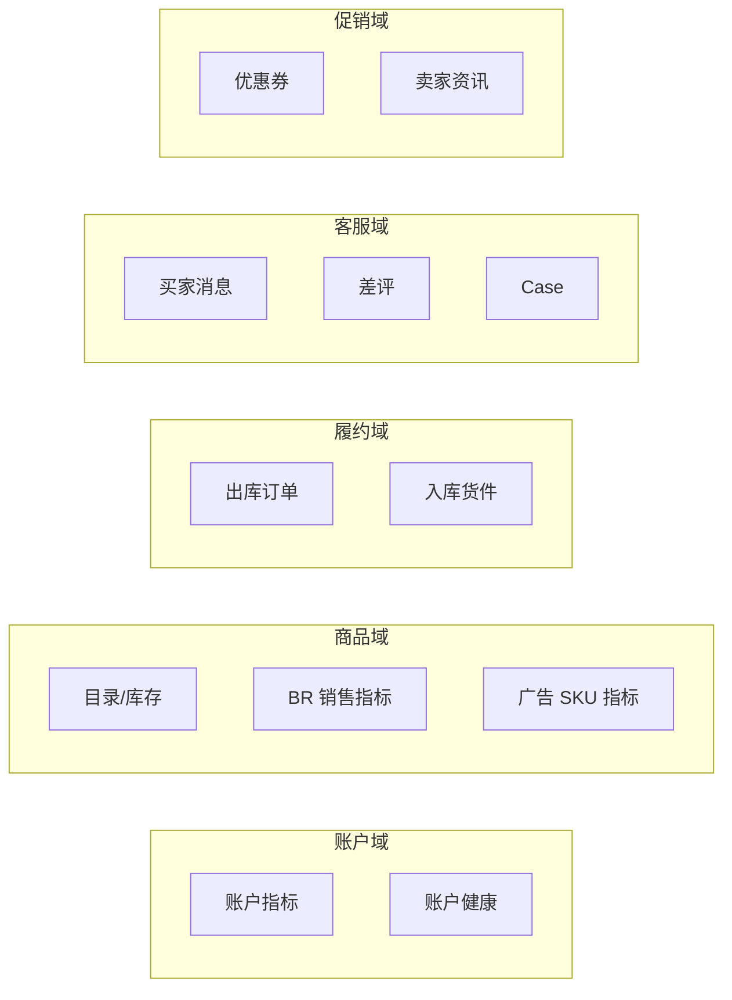

# Amazon 运营侧数据爬取 — 需求方案（V2 重写）

> **版本**：v2.0-draft  
> **日期**：2026-07-11  
> **状态**：待评审  
> **前置文档**：[01-需求与范围.md](./01-需求与范围.md)（一期联调范围）  
> **关联 PoC**：租户 5 / YOTO US / 紫鸟 `browserId=16505337258263`

---

## 1. 背景与问题陈述

CrossHub Amazon 运营模块已具备 **紫鸟 WebDriver → Agent → Java 入库 → Vue 展示** 的完整链路，但当前 `report_crawler.py` 为单体脚本，存在以下结构性问题，导致**运营侧「吃不到数据」**：

| 类别 | 现象 | 业务影响 |
|------|------|----------|
| **页面定位错误** | 订单仅爬 `orders-v3/unshipped`；广告走旧 `/cm/campaigns` 且无 `merchantId` | 出库单不全；SKU 级广告花费/ACOS 为空 |
| **解析器脆弱** | 仅扫 `table tbody tr`；ASIN 正则限 `B0...`；无 Shadow DOM | orders-v3 / Campaign Manager 新 UI 解析失败 |
| **数据合并混乱** | BR、库存、订单、广告在单文件内硬编码合并 | 多 ASIN 共用汇总值、商品名变 ASIN、TOP20 仅 4～6 条有指标 |
| **字段契约不全** | DB 缺 `tacos`、`conversion_rate`；前端展示 7 日字段而后端存 30 日 | TACoS、转化率列长期为 `—` |
| **可观测性不足** | 失败仅截图；无分页面诊断 | 排障靠人工对照 Seller Central |

用户提供的**真实页面入口**与爬虫不一致，是本次重写的直接触发点：

- 订单管理：`https://sellercentral.amazon.com/orders-v3/?page=1`
- FBA 等待：`https://sellercentral.amazon.com/orders-v3/fba/pending?page=1`
- FBA 取消：`https://sellercentral.amazon.com/orders-v3/fba/canceled?page=1`
- 广告活动：`https://advertising.amazon.com/campaign-manager/all-campaigns?merchantId=...&locale=zh_CN`

---

## 2. 业务目标

### 2.1 核心目标

将 Amazon 运营侧数据爬取从「能跑通的 PoC」升级为「**可生产使用的数据采集管道**」，使 CrossHub 展示的指标与 Seller Central 后台**可对账**。

### 2.2 量化目标（验收口径）

| 指标 | 当前（PoC） | V2 目标 |
|------|-------------|---------|
| 有效 SKU 行数（有 ASIN + 真实商品名） | ~11～25，大量空指标 | ≥ 店铺活跃 SKU 的 **80%** 有目录行 |
| TOP20 有销售额/订单 SKU | ~4～6 / 20 | ≥ **15 / 20**（有 BR 数据时） |
| SKU 级广告花费覆盖 | 0 | ≥ **50%** 有花费的 SKU 有 `ad_spend` |
| 出库单采集 | 单页、易漏 | 8 个 orders-v3 子页去重后 ≥ 首页「待处理订单」数的 **90%** |
| 同步成功率（紫鸟在线） | 不稳定，易 `ERR_CONNECTION_CLOSED` | ≥ **95%**（单店单 scope） |
| 单次 `reports` 同步耗时 | 未度量 | ≤ **8 分钟**（P95） |

---

## 3. 干系人与用户故事

| 角色 | 诉求 |
|------|------|
| **Boss** | TOP20、出库单、运营总览待办与后台一致；刷新后有明确成功/失败原因 |
| **运营** | 日报七 Tab（账户/消息/差评/优惠券/货件/Case/出库）有真实数据或可解释空态 |
| **开发/运维** | 分页面可诊断；Agent 日志可定位「哪一页、哪张表、解析了几行」 |
| **实施** | 紫鸟店铺绑定后一键同步，不需手改 URL |

### 用户故事（P0）

| ID | 故事 | 验收 |
|----|------|------|
| US-R01 | 作为运营，我刷新「Business Report」后，TOP20 的 7 日订单/销售额/会话与 BR 子 ASIN 表一致 | 随机抽 3 个 ASIN 人工对账误差 ≤ 1 |
| US-R02 | 作为运营，我刷新后广告花费与 ACOS 来自 Campaign Manager，而非账户汇总 alone | `ad_spend_30d` 有值的 SKU ≥ 1 |
| US-R03 | 作为 Boss，我看出库单含 pending / canceled / shipped 各状态 | `outbound_orders` 按 URL 标注 `status` |
| US-R04 | 作为运维，同步失败时我知道是「哪一页超时/未登录/解析 0 行」 | `result_summary` 含 `page_diagnostics[]` |
| US-R05 | 作为开发，我改某一页面解析器不影响其他页面 | 模块单测 + 回归快照 |

---

## 4. 数据域与页面映射（需求视角）

### 4.1 运营数据域

### 4.2 页面 → 数据域映射（必须对齐卖家后台）

| 数据域 | Seller Central / Advertising URL | CrossHub 落库 | 前端消费 |
|--------|-----------------------------------|---------------|----------|
| 账户指标 | `/home` | `amazon_account_metric` | 账户状况 Tab、运营总览 |
| 账户健康 | `/performance/account/health` | `amazon_account_metric` | 账户状况 Tab |
| 商品目录 | `/myinventory/inventory?fulfilledBy=all` | `amazon_product_snapshot`（基础字段） | TOP20 商品名列 |
| BR 子 ASIN | `/business-reports/detail/sales-traffic-by-asin?cols=...` | `amazon_product_snapshot`（订单/销售额/会话/转化） | TOP20 核心列 |
| 出库订单 | `orders-v3/?page=1` 及 7 个子路径 | `amazon_operational_item`（`outbound_order`） | 出库单 Tab |
| 广告活动 | `advertising.amazon.com/campaign-manager/all-campaigns?merchantId=&locale=zh_CN` | `amazon_product_snapshot`（ad_spend/acos）+ 账户 metric 汇总 | TOP20 广告列 |
| 买家消息 | `/messaging/inbox` | `amazon_operational_item`（`buyer_message`） | 消息 Tab |
| 差评 | `/feedback-manager/index.html` | `amazon_operational_item`（`review`） | 差评 Tab |
| 优惠券 | `/seller-promotions/coupon/home` 等 | `amazon_operational_item`（`coupon`） | 优惠券 Tab |
| 入库货件 | `/fba/inbound-shipment/summary` 等 | `amazon_operational_item`（`shipment`） | 货件 Tab |
| Case | `/home`（首页卡片） | `amazon_operational_item`（`case`） | Case Tab |

### 4.3 Sync Scope 与数据包

| scope | 触发场景（前端） | 必须采集的数据包 | 可选 |
|-------|------------------|------------------|------|
| `account_health` | 账户状况「刷新」 | `metrics` | — |
| `daily` | 今日运营「刷新」 | `metrics` + 七类 `operational_item` | `products`（轻量） |
| `reports` | Boss「刷新数据 / Business Report 刷新」 | `products`（全量指标）+ `outbound_orders` + 广告 | coupons/shipments |
| `insights` | Boss 读库（可触发 sync） | 同 `reports` | — |

---

## 5. 功能范围

### 5.1 In Scope（V2 重写）

1. **页面注册表**：单一来源维护全部 URL、等待策略、产出字段（`page_urls.py` → `page_registry.py`）
2. **分页面 Crawler**：每类页面独立模块（orders / br / inventory / ads / daily_ops）
3. **统一解析层**：Shadow DOM + grid/table 双通道 + innerText 兜底
4. **数据合成器**：目录为底 → 叠加 BR → 订单聚合 → 广告合并；禁止汇总行污染 SKU
5. **分页面诊断**：每页记录 `url / rows / duration_ms / parser / warning`
6. **契约补齐**：爬虫输出 `tacos`、`conversion_rate`；Java 迁移加列（或 JSON 扩展字段）
7. **回归基线**：HTML/innerText 快照 + 单元测试（不依赖紫鸟）
8. **运维脚本**：`open_amazon_sc.py` 与注册表同步；诊断脚本输出 `page_map_summary()`

### 5.2 Out of Scope（V2 不做）

- SP-API 正式对接（仅预留 `merchant_id` 存储位）
- 云端无紫鸟裸 Playwright 多账号
- 写回 Seller Central（发货/回复）— 属 M4 写操作，与读爬虫解耦
- 利润率先验计算（无成本源时保持 `—`）
- 7 日 vs 30 日 BR 日期选择器自动化（V2 先固定与 UI 文案一致的默认区间，文档说明）

---

## 6. 非功能需求

| 项 | 要求 |
|----|------|
| **可靠性** | 单页失败不阻断全量；`partial_success` 写入 `result_summary` |
| **幂等** | 同一 `platform_account_id` + `scope` 进行中任务 409；完成后全量替换快照 |
| **安全** | 禁止将紫鸟凭据、截图写入 git；`crosshub.db` 为真实数据源 |
| **性能** | 单店 `reports` P95 ≤ 8min；单页导航超时 120s，解析超时 30s |
| **兼容** | 不改变 `VITE_USE_TEMU_BACKEND=false` Demo 行为；不重定向到 `*Local.js` |
| **可测试** | 解析器 80%+ 行覆盖靠离线快照；E2E 靠紫鸟可选跑 |

---

## 7. 风险与依赖

| 风险 | 缓解 |
|------|------|
| Amazon UI A/B、区域差异 | 页面注册表版本号 + 多 URL fallback + 快照回归 |
| 紫鸟连接中断 | 重试 1 次；失败明确 `AMAZON_ZINIAO_CONNECTION` |
| Campaign Manager 需二次跳转 | 先 home 解析 `merchantId`，再构造 CM URL |
| BR 表懒加载 | 滚动加载 + 等待 networkidle |
| 字段 7 日/30 日混用 | PRD 统一展示口径；API 层增加 `period_days` 元数据 |

### 依赖

- 紫鸟 WebDriver `:16851` 与 Agent 同机
- Java `:18080` + `amazon_sync_job` 任务流
- 已绑定 `platform_account.external_shop_id` = 紫鸟 `browserId`

---

## 8. 里程碑

| 阶段 | 交付 | 工期估 |
|------|------|--------|
| **M1 页面注册表 + 订单/广告 URL 修复** | `page_registry`、orders 8 页、CM URL | 2 天 |
| **M2 解析器重写** | orders/ads/br 解析器 + 单测快照 | 3 天 |
| **M3 合成器 + 诊断** | composer、page_diagnostics、partial_success | 2 天 |
| **M4 契约与入库** | Java 字段扩展、API 映射、前端空态 | 2 天 |
| **M5 E2E 验收** | 租户 5 全量 sync + 对账报告 | 1 天 |

---

## 9. 验收标准（需求级）

- [ ] `reports` 同步后 `amazon_product_snapshot` 行数 ≥ 店铺 SKU 数 × 80%（有库存或近 30 日订单）
- [ ] TOP20 中 ≥ 15 行有 `revenue_30d` 或 `orders_30d` > 0（BR 有数据时）
- [ ] ≥ 1 个 SKU 的 `ad_spend_30d` > 0（店铺有广告时）
- [ ] `outbound_orders` 含 `pending` + `canceled` + `shipped` 至少各 1 条（后台有时）
- [ ] 同步失败时 UI 展示 `error_message` + 可展开的页面级诊断
- [ ] **禁止**未授权回退 Demo / localStorage 种子

---

## 10. 待确认事项

| # | 问题 | 建议默认 |
|---|------|----------|
| Q1 | BR 展示 7 日还是 30 日？ | UI 文案 7 日；爬虫采 BR 默认区间并在 API 返回 `period_days: 7` |
| Q2 | `merchantId` 是否持久化到 `platform_account`？ | 是，首次解析后写入 `amazon_merchant_id` |
| Q3 | 取消单是否计入 TOP20 订单补全？ | 否，仅 `outbound_orders`；TOP20 仅 BR + 有效 pending 订单 |
| Q4 | 多店铺并行 sync？ | V2 仍串行；同 Agent 队列 |

---

**下一步**：[08-运营爬取重写-技术设计.md](./08-运营爬取重写-技术设计.md)
