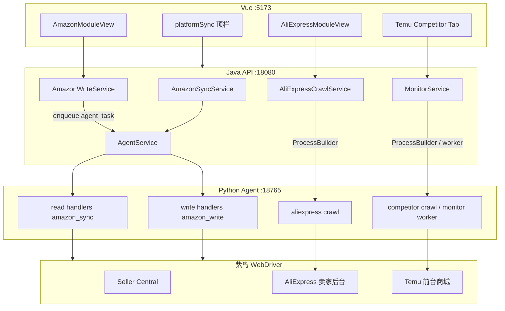

# 三平台运营增强 — 技术方案

> 对应需求：[01-需求文档.md](./01-需求文档.md)

---

## 1. 总体架构



**原则**

- **读**与**写** Amazon 均走 Agent 任务队列（`agent_task`），店铺级互斥。
- AliExpress **优先合并 scope** 减少双 job；顶栏仅编排。
- Temu 竞品复用 **`/api/monitor`**，避免再造 crawl job 类型。

---

## 2. G1 — Amazon 写回 Seller Central

### 2.1 现状代码锚点

| 层 | 文件 | 行为 |
|----|------|------|
| API | `AmazonController` | `PATCH .../messages|reviews|cases`、`PATCH outbound/{id}/ship` |
| Service | `AmazonWriteServiceImpl` | 仅 `operationalItemRepository.save` 改 payload JSON |
| 读爬虫 | `backend/python/app/amazon/report_crawler.py` | 已有 SC URL 常量，无写 DOM |

### 2.2 目标链路

```
Vue PATCH → AmazonWriteService.enqueueWrite()
  → agent_task (task_type=amazon_write, payload={action, item_id, ...})
  → Agent poll → Python amazon_write_handler
  → 紫鸟 startBrowser → Playwright 操作 SC 页面
  → POST /api/agent/tasks/{id}/complete {status, result, screenshots}
  → AmazonWriteBridge.onComplete → 更新 operational_item + amazon_write_job
```

### 2.3 数据模型（新增）

**表 `amazon_write_job`**

| 字段 | 类型 | 说明 |
|------|------|------|
| id | TEXT PK | `amz_write_{uuid}` |
| tenant_id | INTEGER | |
| platform_account_id | TEXT | |
| agent_task_id | TEXT | |
| item_id | TEXT | `amazon_operational_item.id` |
| action | TEXT | `buyer_message_reply` / `review_handle` / `case_ack` / `outbound_ship` |
| status | TEXT | pending/running/success/failed |
| request_json | TEXT | 模板、运单号等 |
| result_json | TEXT | SC 订单号、截图路径 |
| error_code / error_message | TEXT | |
| created_at / finished_at | TEXT | |

**`amazon_operational_item.payload` 扩展**

```json
{
  "status": "pending_write | replied | ...",
  "write_job_id": "amz_write_...",
  "platform_confirmed": true,
  "platform_confirmed_at": "2026-07-11 10:00:00"
}
```

### 2.4 Agent 写操作映射

| action | SC 入口 URL | Playwright 动作 |
|--------|-------------|-----------------|
| `buyer_message_reply` | `/messaging/inbox` | 打开 thread → 选模板/填文本 → Send |
| `outbound_ship` | `/orders-v3/unshipped` | 找到订单 → Confirm shipment → 填 tracking |
| `review_handle` | `/feedback-manager` | 打开 1-star → Contact buyer / Leave note（按站点 UI） |
| `case_ack` | Case 详情页（payload 带 url） | Mark as read / Respond |

**实现模块**：`backend/python/app/amazon/write_actions.py`（按 action 策略类）+ `agent/handlers/amazon_write.py`。

### 2.5 Java 改动要点

1. `AmazonWriteServiceImpl`：PATCH 时 **不直接改 status=success**，改 `pending_write` 并 `enqueueWrite`。
2. `AmazonAgentSyncBridge` 同级新增 `AmazonAgentWriteBridge.onComplete`。
3. `AmazonSyncServiceImpl` 与 write 共用 **店铺锁**：`integration_agent` + `platform_account_id` 维度 409。
4. 新增 `GET /api/amazon/write/{jobId}` 供前端轮询（或复用 agent task 状态）。

### 2.6 前端改动

- `amazonApi.js`：PATCH 返回 `{ write_job_id, status: 'pending' }`；组件轮询至 success/failed。
- 按钮文案：「提交中…」「已在 Amazon 确认」/ 失败 Toast + 保留编辑内容。

### 2.7 备选：SP-API（P3）

| API | 用途 | 前提 |
|-----|------|------|
| Messaging API v1 | 买家消息 | refresh_token + LWA |
| Orders API patch | 发货 | 同上 |

**建议**：短期 WebDriver 写回；中期读切 SP-API、写保留 WebDriver 兜底。

---

## 3. G2 — AliExpress 违规纳入顶栏同步

### 3.1 现状代码锚点

| 层 | 文件 | 行为 |
|----|------|------|
| 顶栏 | `platformSync.js` → `syncAliExpressStores` | 仅 `refreshAliExpressDataWithCrawl()` |
| API | `AliExpressController` | `POST /crawl`、`POST /violations/sync` 各自 `triggerViolationSync()` |
| Python | `aliexpress_crawler.py` | `scope in ("all", "violations")` 已支持 |

### 3.2 方案 A（推荐）：单次 crawl `scope=all`

**Java** `AliExpressCrawlRequest` 增加 `scope` 字段，默认 `orders`；顶栏传 `all`。

```java
// AliExpressCrawlServiceImpl.runPythonCrawl
// argv: crawl.py --tenant-id N --scope all
```

**Python** 一次浏览器会话：orders → violations，单 job 单 commit。

**优点**：无 409 双 job；耗时略增但 UX 一致。  
**缺点**：需改 Java 传参 + 回归 orders-only 路径。

### 3.3 方案 B（备选）：顶栏链式两次 API

```javascript
// platformSync.js syncAliExpressStores
const crawlRes = await refreshAliExpressDataWithCrawl()
const violRes = await refreshAliExpressViolationsWithCrawl() // 封装 violations/sync + poll
```

**优点**：改动仅前端 + 复用现有 endpoint。  
**缺点**：两次 job 可能 409；需 `violations/sync` 等待 orders job 结束或合并锁。

### 3.4 顶栏 UI 契约

```javascript
target.message = `已同步 ${orderCount} 笔订单、${violationCount} 条违规`
target.rowCount = orderCount + violationCount
// partial: 订单 success + 违规 failed → status=partial
```

### 3.5 配置项（P2）

`tenant_feature` 或 localStorage：

```json
{ "aliexpress_sync_violations": true }
```

---

## 4. G3 — Temu 竞品自动监控

### 4.1 现状代码锚点

| 层 | 文件 | 行为 |
|----|------|------|
| UI | `CompetitorAnalysis.vue` | 手动 discover / analyze |
| API | `POST /api/temu/competitors/discover` | 关键词发现候选 |
| Monitor | `MonitorController` | `/api/monitor/targets/{id}/trigger`、schedule |
| Python | `competitor_crawl.py`、`monitor worker` | 快照入库 `temu_competitor_snapshot` |

### 4.2 目标模型

**统一用 monitor_target**（已有表）：

| 字段 | 示例 |
|------|------|
| platform | `temu` |
| target_type | `competitor_mall` |
| external_key | mall_id 或 competitor_id |
| config_json | `{"url":"https://www.temu.com/mall.html?mall_id=..."}` |
| auto_sync | `1` 随顶栏 / `2` 仅定时 / `0` 手动 |

**迁移**：Boss 在竞品 Tab 添加竞店时 `POST /api/monitor/targets`；旧 `temu_competitor` 表数据一次性 import。

### 4.3 顶栏编排

```javascript
// platformSync.js syncTemuStores 末尾
const targets = await fetchMonitorTargets({ platform: 'temu', auto_sync: 1 })
for (const t of targets.filter(canCrawlToday)) {
  await triggerMonitorTarget(t.id, { force: false })
}
```

**并发控制**：

- 每租户顶栏最多触发 **3** 个竞品 job（可配置）。
- `profile_busy` 时 skipped，不阻塞 Temu 卖家后台 crawl。

### 4.4 定时调度

复用 `MonitorServiceImpl` + Java `@Scheduled`：

- 默认 `interval_minutes=1440`，`enabled=1`。
- Python monitor worker 消费 `monitor_job`（已有）。

### 4.5 前端竞品 Tab

- `temuCompetitors.js` 后端模式：读 `/api/monitor/targets?platform=temu` + `/latest`。
- 展示 `last_snapshot_at`、`signals`（上新/异常销量）。
- 手动「立即分析」→ `POST trigger`（force=true）。

---

## 5. 横切 concern

### 5.1 错误码

| code | 场景 |
|------|------|
| `AMAZON_WRITE_IN_PROGRESS` | 写任务进行中 |
| `AMAZON_WRITE_DOM_FAILED` | SC 页面元素变更 |
| `AMAZON_WRITE_NOT_LOGGED_IN` | 会话失效 |
| `CRAWL_IN_PROGRESS` | AliExpress job 冲突 |
| `COMPETITOR_FRONTEND_LOGIN_REQUIRED` | Temu 前台未登录 |

### 5.2 SQLite 并发

- 已有 WAL + `busy_timeout=30000`；写 job 表 insert 短事务。
- Amazon 写 complete 与 heartbeat 仍可能碰撞 → Agent heartbeat 重试（已实现）。

### 5.3 安全

- 写操作 payload **禁止**前端传 SC 密码；仅 item_id + 业务字段。
- Agent task payload 含 `browser_id` / `browser_oauth`（服务端查 platform_account）。

---

## 6. 风险与缓解

| 风险 | 缓解 |
|------|------|
| SC DOM 变更导致写失败 | 截图 + 错误码；人工 fallback 链到 SC |
| AliExpress scope=all 超时 | 提高 timeout；violations 失败 partial |
| Temu 竞品与卖家 crawl 抢 profile | 竞品用 **前台** profile；卖家用 **seller** profile；顶栏顺序：先 seller 后 competitor |
| 写操作误发 | 二次确认弹窗 + 30s 节流 |

---

## 7. 文件改动清单（摘要）

| 特性 | Java | Python | Vue |
|------|------|--------|-----|
| Amazon 写回 | `AmazonWriteServiceImpl`, `AmazonWriteJob*`, migration V10 | `amazon/write_actions.py`, agent handler | `amazonApi.js`, 各 Panel |
| AE 违规顶栏 | `AliExpressCrawlRequest.scope` | `crawl.py --scope` | `platformSync.js`, `aliexpressApi.js` |
| Temu 竞品自动 | `MonitorService` 扩展 temu 导入 | worker 已有 | `platformSync.js`, `CompetitorAnalysis.vue`, `temuCompetitorsApi.js` |
